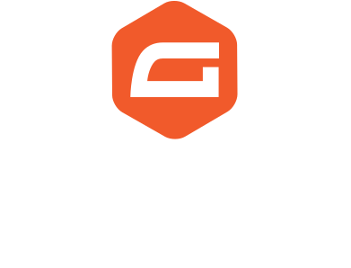

<p align="center">
  
  <span style="vertical-align: middle; font-size: 24px; font-weight: bold; margin: 0 10px;">&#8594;</span>
  
</p>


# CleverTap Integration for Gravity Forms

This plugin automatically sends user data from Gravity Forms submissions to [CleverTap](https://clevertap.com) as a **profile update** and **event** — without needing to manually add hooks for each form.

When a user submits a form, the plugin:
- Updates their **CleverTap profile** with a `$add` operation to the `Form Signups` field
- Schedules a `Newsletter Signup` event to fire **4 minutes later**

---

## Features

- Zero-code setup for form-to-CleverTap syncing
- Supports custom tag per form
- Uses email as the unique identity
- Deferred (delayed) event sending via WordPress cron
- Optional debug logging to Gravity Forms and PHP logs

---

## Setup Instructions

### 1. Plugin Configuration

1. Upload the plugin to your WordPress installation
2. Navigate to **Settings > CleverTap Integration**
3. Enter your:
    - CleverTap Account ID
    - CleverTap Passcode
    - (Optional) Enable debug logging

### 2. Form Mapping

This plugin uses a table `wp_ctgf_form_configs` (or your custom prefix) to map:
- `form_id`
- `email_field` (the Gravity Forms field ID that holds the email address)
- `tag` (value to send to CleverTap)
- `active` (1 = enabled, 0 = disabled)

Each row represents a form-to-tag mapping.

**Example Row:**

| form_id | email_field | tag          | active |
|---------|-------------|--------------|--------|
| 5       | 1           | Retreat 2025 | 1      |

---

## Data Sent to CleverTap

### Profile Update

```json
{
  "d": [
    {
      "identity": "user@example.com",
      "type": "profile",
      "profileData": {
        "Form Signups": {
          "$add": ["Retreat 2025"]
        }
      }
    }
  ]
}
```

### Event (Immediate & Delayed)

```json
{
  "d": [
    {
      "identity": "user@example.com",
      "type": "event",
      "evtName": "Newsletter Signup",
      "evtData": {
        "tag": "Retreat 2025",
        "form_id": 5
      }
    }
  ]
}
```

---

## Developer Notes

- No manual hook setup needed (`gform_after_submission` is automatically handled)
- Supports delayed jobs via `wp_schedule_single_event`
- Logging can be toggled with the `ctgf_enable_logging` option
- Delayed jobs hook into `ctgf_send_delayed_event`

---

## Debugging

To enable debug logs:

1. Go to **Settings > CleverTap Integration**
2. Enable **Debug Logging**

Logs will be sent to:
- PHP `error_log`
- Gravity Forms debug logs (if enabled)

---

## Contributions

Want to add support for more fields or events? Pull requests and enhancements are welcome in private forks.

---
