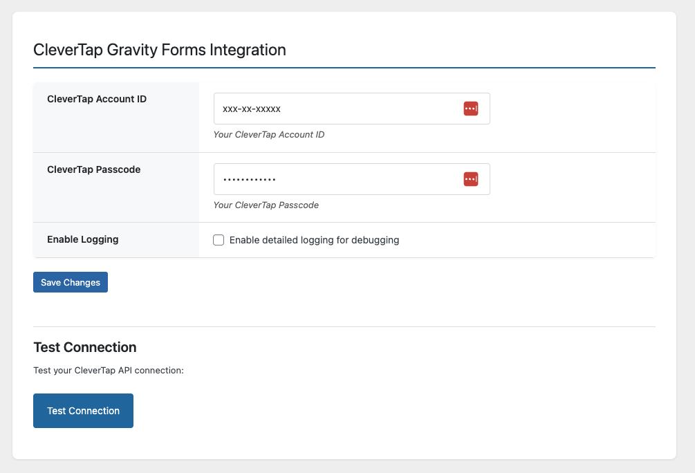
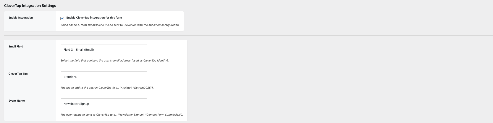
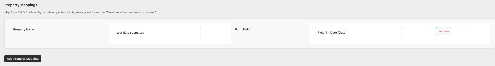
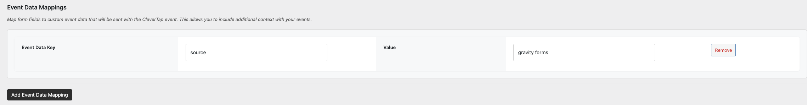

<p align="center">
  
  <span style="vertical-align: middle; font-size: 24px; font-weight: bold; margin: 0 10px;">&#8594;</span>
  
</p>


# CleverTap Integration for Gravity Forms

This plugin automatically sends user data from Gravity Forms submissions to [CleverTap](https://clevertap.com) as a **profile update** and **event** — without needing to manually add hooks for each form.

When a user submits a form, the plugin:
- Updates their **CleverTap profile** with custom properties mapped from form fields
- Schedules a **custom event** (configurable per form) to fire **4 minutes later**

---

## Features

- Zero-code setup for form-to-CleverTap syncing
- Flexible property mapping - send any form field to CleverTap as a custom property
- Supports legacy tag functionality for backward compatibility
- Supports custom event name per form
- Uses email as the unique identity
- Deferred (delayed) event sending via WordPress cron
- Optional debug logging to Gravity Forms and PHP logs

---

## Setup Instructions

### 1. Plugin Configuration

1. Upload the plugin to your WordPress installation
2. Navigate to **Settings > CleverTap Integration**
3. Enter your:
   - CleverTap Account ID
   - CleverTap Passcode
   - (Optional) Enable debug logging



### 2. Form Settings
1. Open the form you would like to connect to CleverTap and select Settings -> CleverTap Integration
2. Enable the integration for this form
3. Select the email field from the form (This is used as the identity for the user in CleverTap)
4. Set the name for the Tag. This will be sent as the value for a 'Form Signups' key in the user properties.
5. Set the name for the Event. This is the event that you would like to trigger after the user properties have been updated.




### 3. Property Mapping
**Map form fields to CleverTap profile properties. Each property will be sent to CleverTap when the form is submitted.**
1. Click the "Add Property Mapping" button to add a new mapping
2. Enter the property name and associate it with a field form




### 4. Event Data Mapping
**Map form fields to custom event data that will be sent with the CleverTap event. This allows you to include additional context with your events.**
1. Click the "Add Event Data Mapping" button to add a new mapping
2. Enter the data as a Key => Value pair. For example, campaign => Facebook



---

## Database

This plugin uses a table `wp_ctgf_form_configs` to store form configurations including:
- `form_id`
- `email_field` (the Gravity Forms field ID that holds the email address)
- `tag` (legacy support - value to send to CleverTap as a tag)
- `event_name` (custom event name to send to CleverTap)
- `property_mappings` (JSON array of custom property mappings)
- `active` (1 = enabled, 0 = disabled)

Each row represents a complete form configuration.

**Example Configuration:**

| form_id | email_field | tag          | event_name           | property_mappings                                                    | active |
|---------|-------------|--------------|----------------------|----------------------------------------------------------------------|--------|
| 5       | 1           | Retreat 2025 | Retreat Registration | `[{"property_name":"Phone","form_field":"3"}]` | 1      |

The table also includes:
- `event_mappings` (JSON array of custom event data mappings)

**Example Event Mappings:**
```json
[
  {"event_key":"lead_source","form_field":"5"},
  {"event_key":"campaign","form_field":"6"},
  {"event_key":"referrer","form_field":"7"}
]
```

---

## Data Sent to CleverTap

### Profile Update

```json
{
  "d": [
    {
      "identity": "user@example.com",
      "type": "profile",
      "profileData": {
        "Phone": "+1234567890",
        "Company": "Acme Corp",
        "Form Signups": {
          "$add": ["Retreat 2025"]
        }
      }
    }
  ]
}
```


### Event 

```json
{
  "d": [
    {
      "identity": "user@example.com",
      "type": "event",
      "evtName": "Retreat Registration",
      "evtData": {
        "form_id": 5,
        "tag": "Retreat 2025",
        "lead_source": "Google Ads",
        "campaign": "Summer 2024",
        "referrer": "facebook.com"
      }
    }
  ]
}
```

---

## Developer Notes

- Flexible property mapping system allows sending any form field to CleverTap
- Flexible event data mapping system allows sending custom event data
- Supports delayed jobs via `wp_schedule_single_event`
- Logging can be toggled with the `ctgf_enable_logging` option
- Delayed jobs hook into `ctgf_send_delayed_event` with custom event names
- Database schema automatically migrates to support property mappings
- Database schema automatically migrates to support event data mappings

---

## Debugging

To enable debug logs:

1. Go to **Settings > CleverTap Integration**
2. Enable **Debug Logging**

Logs will be sent to:
- PHP `error_log`
- Gravity Forms debug logs (if enabled)

---

## Contributions

Want to add support for more fields or events? Pull requests and enhancements are welcome in private forks.

---
